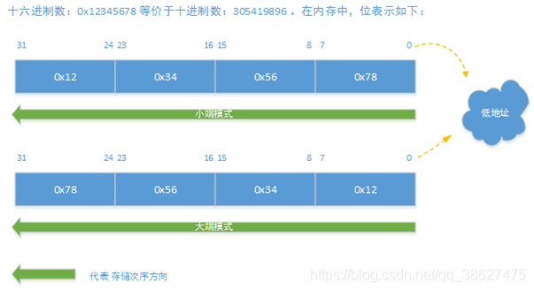

# 什么是大小端

`小端模式`，是指数据的高字节保存在内存的高地址中，而数据的低字节保存在内存的低地址中。简而言之，从低内存地址开始排列。
`大端模式`，是指数据的高字节保存在内存的低地址中，而数据的低字节保存在内存的高地址中，简而言之，从高内存地址开始排列。

**记忆**：“小端低低”

# 为什么有大小端模式之分

在操作系统中，x86和一般的OS（如windows，FreeBSD,[Linux](https://so.csdn.net/so/search?q=Linux&spm=1001.2101.3001.7020)）使用的是小端模式。但比如Mac OS是大端模式。

在计算机系统中，我们是以字节为单位的，每个地址单元都对应着一个字节，一个字节为8bit。但是在C语言中除了8bit的char之外，还有16bit的short型，32bit的long型（要看具体的编译器）。另外，对于位数`大于8位的处理器`，例如16位或者32位的处理器，由于`寄存器宽度`大于一个字节，那么必然存在着如何将安排多个字节的问题。因此就导致了大端存储模式和小端存储模式。

# 应用场景

1、不同端模式的处理器进行数据传递时必须要考虑端模式的不同
2、在`网络上传输数据时，由于数据传输的两端对应不同的硬件平台`，采用的`存储字节顺序可能不一致`。所以在TCP/IP协议规定了在网络上必须采用`网络字节顺序，也就是大端模式`。对于char型数据只占一个字节，无所谓大端和小端。而对于非char类型数据，必须在数据发送到网络上之前将其转换成大端模式。接收网络数据时按符合接受主机的环境接收。